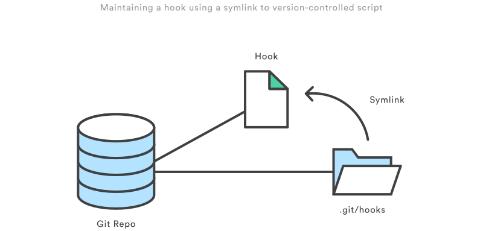

# Git-hooks

Git hooks are scripts that run automatically every time a particular event occurs in a Git repository. They let you customize Git’s internal behavior and trigger customizable actions at key points in the development life cycle.

Hooks can get their arguments via the environment, command-line arguments, and stdin. See the documentation for each hook below for details.

Common use cases for Git hooks include encouraging a commit policy, altering the project environment depending on the state of the repository, and implementing continuous integration workflows. But, since scripts are infinitely customizable, you can use Git hooks to automate or optimize virtually any aspect of your development workflow.

## Installing Hooks

Hooks reside in the ``.git/hooks`` directory of every Git repository. Git automatically populates this directory with example scripts when you initialize a repository. If you take a look inside ``.git/hooks``, you’ll find the following files:

	applypatch-msg.sample       pre-push.sample
	commit-msg.sample           pre-rebase.sample
	post-update.sample          prepare-commit-msg.sample
	pre-applypatch.sample       update.sample
	pre-commit.sample

These represent most of the available hooks, but the ``.sample`` extension prevents them from executing by default. To “install” a hook, all you have to do is remove the .sample extension. Or, if you’re writing a new script from scratch, you can simply add a new file matching one of the above filenames, minus the ``.sample`` extension.

## Scripting Languages

The built-in scripts are mostly shell and PERL scripts, but you can use any scripting language you like as long as it can be run as an executable. The shebang line (#!/bin/sh) in each script defines how your file should be interpreted. So, to use a different language, all you have to do is change it to the path of your interpreter.

## Scope of Hooks

Hooks are local to any given Git repository, and they are not copied over to the new repository when you run git clone. And, since hooks are local, they can be altered by anybody with access to the repository.

This has an important impact when configuring hooks for a team of developers. First, you need to find a way to make sure hooks stay up-to-date amongst your team members. Second, you can’t force developers to create commits that look a certain way—you can only encourage them to do so.

Maintaining hooks for a team of developers can be a little tricky because the ``.git/hooks`` directory isn’t cloned with the rest of your project, nor is it under version control. A simple solution to both of these problems is to store your hooks in the actual project directory (above the ``.git`` directory). This lets you edit them like any other version-controlled file. To install the hook, you can either create a symlink to it in ``.git/hooks``, or you can simply copy and paste it into the ``.git/hooks`` directory whenever the hook is updated.

As an alternative, Git also provides a Template Directory mechanism that makes it easier to install hooks automatically. All of the files and directories contained in this template directory are copied into the ``.git`` directory every time you use ``git init`` or ``git clone``.

All of the local hooks described below can be altered—or completely un-installed—by the owner of a repository. It’s entirely up to each team member whether or not they actually use a hook. With this in mind, it’s best to think of Git hooks as a convenient developer tool rather than a strictly enforced development policy.

That said, it is possible to reject commits that do not conform to some standard using server-side hooks. We’ll talk more about this later in the article.

## Which Hooks are available?

See [documentation](https://git-scm.com/docs/githooks).