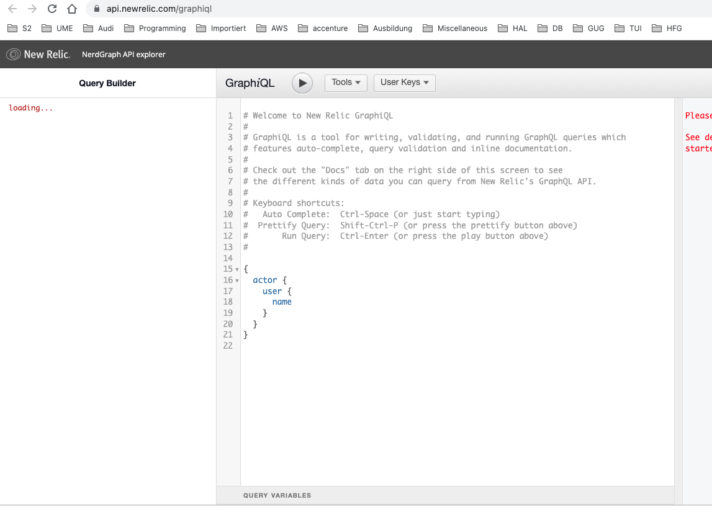

# how can i filter/remove data from digested data in newrelic

One way to manage your data ingest is to set up data dropping rules. For data that supports data dropping, you can:

- Filter out unimportant low-value data
- Filter out potentially sensitive data

When you set up data dropping rules, only data from that point onward is affected. Existing data that has already been ingested cannot be edited or deleted.

## Requirements

The ability to create and edit drop filter rules depends on which user model you're on:

- Newer user model: you must be assigned a role with "NRQL drop rules" capabilities.
- Original user model: you must have an Admin role.

## Create drop data rule

	**CAUTION**
	Use caution when deciding to drop data. The data you drop is not recoverable. Before using this feature, please review caution information below.

To drop data, create a NerdGraph-format drop rule that includes:

- A NRQL string that specifies what data types to drop
- An action type specifying how to apply the NRQL string

You can form and make the call in the NerdGraph explorer.



The limit on nrql query length is 4096 characters. If it exceeds the length the nerdGraph will throw an error ```INVALID_NRQL_TOO_LONG```.

There are two ways to drop data:

- **Drop entire data types** or a data subset (with optional filter). This uses the ```DROP_DATA``` action type and uses NRQL of the form:

	```sql
	SELECT * FROM DATA_TYPE_1, DATA_TYPE_2 (WHERE OPTIONAL_FILTER)
	```

	For this type of drop rule, you cannot use anything other than ```*``` in the ```SELECT``` clause.

- **Drop attributes from data types** (with optional filter). This uses the ```DROP_ATTRIBUTES``` action type and uses NRQL of the form:

	```sql
	SELECT dropAttr1, dropAttr2 FROM DATA_TYPE (WHERE OPTIONAL_FILTER)
	```

	For this type of drop rule, you must pass in a non-empty list of raw attributes names.

## NRQL restrictions

Not all NRQL clauses make sense for generating drop rules. You can provide a ```WHERE``` clause to select data with specific attributes. Other features such as ```LIMIT```, ```TIMESERIES```, ```COMPARE WITH```, ```FACET```, and other clauses cannot be used.

```SINCE``` and ```UNTIL``` are not supported in drop rules. If you have time-specific rules (say, drop everything until a time in the future), use ```WHERE timestamp < (epoch milliseconds in the future)```. You also can't use ```SINCE``` to drop historical data: NRQL drop rules only apply to data reported after the drop rule was created. If you need to delete data that has already been reported, contact your New Relic representative.

The two action types have these restrictions:

- ```DROP_DATA``` can use only ```SELECT *```.
- ```DROP_ATTRIBUTES``` requires use of ```SELECT``` with "raw" attributes (attributes with no aggregator function applied). This also means you cannot use ```SELECT *```. Additionally, there are some attributes that are integral to their data type and cannot be dropped (such as timestamp on event data). If you include them, registration will fail.

## Example drop rules

Here are some example drop rules:

### Drop two event types

Let's say you notice you have some event types being sent to New Relic that are not important to you. Also, stopping the source from sending those event types quickly is unrealistic, requiring changes to agents and/or API instrumentation. Using a drop rule is an easier way to accomplish the same goal.

Here is an example NerdGraph call that drops two event types: ```Event1``` and ```Event2```.

```json
mutation {
    nrqlDropRulesCreate(accountId: YOUR_ACCOUNT_ID, rules: [
        {
            action: DROP_DATA
            nrql: "SELECT * FROM Event1, Event2"
            description: "Drops all data for Event1 and Event2."
        }
    ])
    {
        successes { id }
        failures {
            submitted { nrql }
            error { reason description }
        }
    }
}
```

### Drop events meeting certain criteria

Let’s say you have a high volume custom event type that arrives from multiple sources. If you don't find all of that data important, you can use a drop rule. Here is an example of a drop rule that filters out events based on specific criteria.

```json
mutation {
    nrqlDropRulesCreate(accountId: YOUR_ACCOUNT_ID, rules: [
        {
            action: DROP_DATA
            nrql: "SELECT * FROM MyCustomEvent WHERE appName='LoadGeneratingApp' AND environment='development'"
            description: "Drops all data for MyCustomEvent that comes from the LoadGeneratingApp in the dev environment, because there is too much and we don’t look at it."
        }
    ])
    {
        successes { id }
        failures {
            submitted { nrql }
            error { reason description }
        }
    }
}
```
